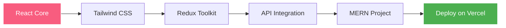

<div align="center">


<br>


<br><br>

<a href="https://linkedin.com/in/kshitijrokade514"></a>
<a href="https://instagram.com/kshitij_jain5"></a>
<a href="mailto:rokadekshitij514@gmail.com"></a>
<a href="https://bento.me/kshitizzz5"></a>

</div>

<br>

## 👋 About Me

```javascript
const kshitij = {
  role: "Frontend Developer",
  stack: "MERN / MEAN",
  currentFocus: "Advanced React, Redux Toolkit, UI Design",
  learning: ["GitLab", "DevOps"],
  funFact: "Turns coffee ☕ into clean code"
};
```

- 🔭 Building **full-stack web apps** with the MERN stack
- 🌱 Currently deepening skills in **React, Tailwind CSS & Redux Toolkit**
- 🎨 Passionate about **UI/UX design** and clean interfaces
- 📫 Reach me at **rokadekshitij514@gmail.com**

<br>

## 🛠️ Tech Stack

<div align="center">

**Frontend**
<br>


<br><br>

**Backend & Database**
<br>


<br><br>

**Tools & Design**
<br>


<br><br>

**Cloud & DevOps**
<br>


</div>

<br>

## 📊 GitHub Stats

<div align="center">
  
  
</div>

<div align="center">
  
</div>

<div align="center">
  
</div>

<br>

## 🚀 Current Roadmap


```mermaid
graph LR
    A[React Core] --> B[Tailwind CSS]
    B --> C[Redux Toolkit]
    C --> D[API Integration]
    D --> E[MERN Project]
    E --> F[Deploy on Vercel]

    style A fill:#F85D7F,stroke:#fff,color:#fff
    style F fill:#4CAF50,stroke:#fff,color:#fff
```

<br>


<br><br>


</div>
