# 💫 Kshitij Rokade

<div align="center">
  
</div>

<div align="center">
  
</div>

---

## 🚀 About Me


```yaml
name: Kshitij Rokade
located_in: India 🇮🇳
current_job: Frontend Developer
education: ["Self-taught", "Always Learning"]
company: Building awesome projects

fields_of_interests: ["Web Development", "UI/UX Design", "Open Source"]
technical_background: ["Frontend Development", "Git/GitOps", "Cloud Services"]
currently_learning: ["GitLabs", "Advanced React Patterns"]
```

- 🔭 Currently working on **Next-gen Web Applications**
- 🌱 Exploring **GitLabs** and **DevOps practices**
- 👨‍💻 Portfolio: **[bento.me/kshitizzz5](https://bento.me/kshitizzz5)**
- 💬 Ask me about **Git, GitHub, GitOps, React**
- 📫 Reach me: **rokadekshitij514@gmail.com**
- ⚡ Fun fact: **I turn coffee into code** ☕

---

## 🌐 Connect With Me

<div align="center">
  <a href="https://linkedin.com/in/kshitijrokade514">
    
  </a>
  <a href="https://instagram.com/kshitij_jain5">
    
  </a>
  <a href="mailto:rokadekshitij514@gmail.com">
    
  </a>
</div>

---

## 🛠️ Tech Stack

<div align="center">

### 💻 Frontend


### 🎨 Design & Tools


### ⚙️ Backend & Database


### ☁️ Cloud & DevOps


### 🧪 Testing & Other


</div>

---

## 📊 GitHub Analytics

<div align="center">
  
  
</div>

<div align="center">
  
</div>

<div align="center">
  
</div>

---

## 📈 Activity Graph

<div align="center">
  
</div>

---

## 🎯 Current Goals

```mermaid
graph LR
    A[🚀 Learn GitLabs] --> B[⚡ Master DevOps]
    B --> C[🌟 Open Source Contributions]
    C --> D[🏆 Build Innovative Projects]
    D --> E[💼 Career Growth]
```

<div align="center">



</div>

---

## 💼 Featured Projects

<div align="center">
  <a href="https://github.com/kshitij-rokade">
    
  </a>
</div>

---

## 🎨 Fun Extras

<div align="center">
  
</div>

<div align="center">
  <h3>✨ "Code is like humor. When you have to explain it, it's bad." - Cory House ✨</h3>
</div>

---

<div align="center">
  
  <br>
  <h3>💖 Thanks for visiting my profile! Let's connect and build something amazing together! 💖</h3>
</div>

<div align="center">
  
</div>
