```mermaid
graph TD
    A[🎯 Current Focus] --> B[🔧 GitLabs Mastery]
    A --> C[⚡ DevOps Pipeline]
    A --> D[🌐 Full Stack Projects]
    B --> E[🚀 Production Ready Apps]
    C --> E
    D --> E
    E --> F[💼 Career Excellence]
    
    style A fill:#F85D7F,stroke:#fff,stroke-width:3px,color:#fff
    style F fill:#4CAF50,stroke:#fff,stroke-width:3px,color:#fff
```

# </img> Kshitij Rokade

  

  

  

---

##  About Me

  
  
  

    
  

 

  
|  **Field** |  **Details** |
|---|---|
| 🔭 **Current Work** | Building **Next-generation Web Applications** |
| 🌱 **Learning** | **GitLabs** & **Advanced DevOps Practices** |
| 👨‍💻 **Portfolio** | **[bento.me/kshitizzz5](https://bento.me/kshitizzz5)** |
| 💬 **Expertise** | **Git, GitHub, GitOps, React, Frontend Magic** |
| 📫 **Contact** | **rokadekshitij514@gmail.com** |
| ⚡ **Superpower** | **Converting ☕ into Clean Code** |

---

##  Connect With Me

  <table>
    <tr>
      <td align="center">
        <a href="https://linkedin.com/in/kshitijrokade514">
          
            
          
           
          <b>Professional Network</b>
        </a>
      </td>
      <td align="center">
        <a href="https://instagram.com/kshitij_jain5">
          
            
          
           
          <b>Creative Journey</b>
        </a>
      </td>
      <td align="center">
        <a href="mailto:rokadekshitij514@gmail.com">
          
           
          
        </a>
      </td>
      <td align="center">
        <a href="https://bento.me/kshitizzz5">
          
           
          
        </a>
      </td>
    </tr>
  </table>

---

##  Tech Arsenal

  
   
  
  ###  Frontend Mastery
  
  
  
  
  
  
  
  
  ###  Backend Power
  
  
  
  
  
  
  
  ###  Design & Creative
  
  
  
  
  
  
  ###  Cloud & DevOps
  
  
  
  
  
  

  

---

##  GitHub Analytics

  
    
  
  

    
    
  

  
   
  
  
  
    
  
  
  

  

---

##  Activity Graph

  

  

---

##  Current Mission

  
  
    
  

  

---

##  Featured Work

  <table>
    <tr>
      <td width="50%">
        <h3 align="center">🌟 Project Showcase</h3>
        
  
          
        

      </td>
      <td width="50%">
        <h3 align="center">🚀 Latest Innovation</h3>
        

          
        

      </td>
    </tr>
  </table>

  

---

##  Fun Zone

  
  
    
  
  
  
    
  
  ###  Quick Stats
  
  <table align="center">
    <tr>
      <td>☕ Coffee Consumed</td>
      <td>∞ Cups</td>
    </tr>
    <tr>
      <td>🐛 Bugs Fixed</td>
      <td>999+ Issues</td>
    </tr>
    <tr>
      <td>💡 Ideas Generated</td>
      <td>Countless</td>
    </tr>
    <tr>
      <td>🎯 Success Rate</td>
      <td>Always Improving</td>
    </tr>
  </table>
  

---

  
  
   
  
  
  
    
  
  
  
   
  
  

  

